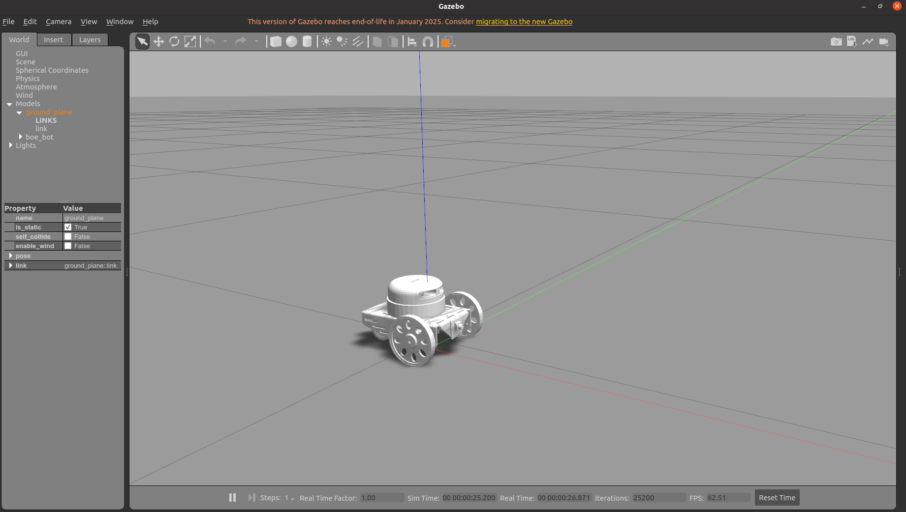
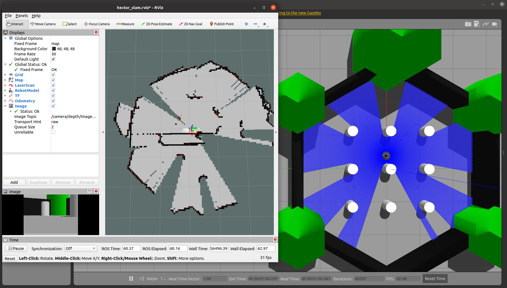
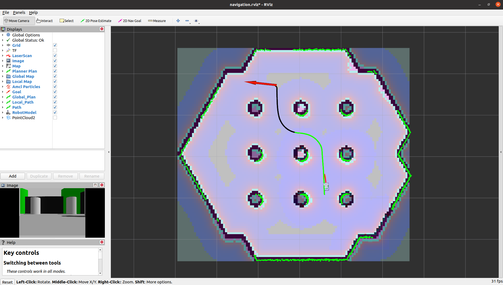
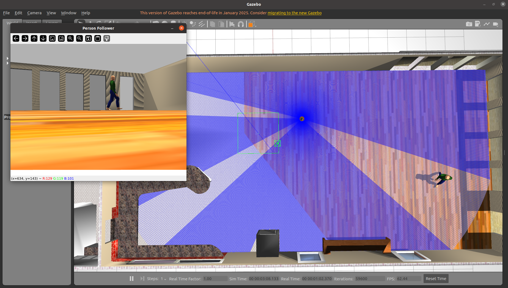

# Diff Drive Robot

This project is a simulation of a differential drive robot using **ROS Noetic** and **Gazebo**. It includes several sub-packages to simulate the robot in various scenarios such as navigation, SLAM mapping, and human tracking. The robot can be controlled via a keyboard or ROS commands, supporting tasks like navigation and mapping.

---

## Requirements

- Ubuntu 20.04
- ROS Noetic
- Python 3.8+ (required for `ultralytics`)

## Installation and Setup

1. Create and configure a Catkin workspace:
   ```bash
   mkdir -p ~/catkin_ws/src
   cd ~/catkin_ws/src
   ```

2. Clone the repository:
   ```bash
   git clone https://github.com/23hoangkt/Diff_drive_robot.git
   ```

3. Install dependencies:
   ```bash
   cd ~/catkin_ws
   rosdep install --from-paths src --ignore-src -r -y
   ```

4. Build the workspace:
   ```bash
   catkin_make
   source devel/setup.bash
   ```

5. Install additional ROS packages:
   ```bash
   sudo apt update
   sudo apt install ros-noetic-vision-msgs
   pip3 install ultralytics
   sudo apt install ros-noetic-hector-slam
   sudo apt install ros-noetic-slam-karto
   ```

## Running the Project

### 1. Launch Gazebo with the robot (package `boe_bot`)

```bash
roslaunch boe_bot gazebo.launch
```



### 2. Launch SLAM with Hector SLAM (package `boe_bot_slam`)

```bash
roslaunch boe_bot_slam boe_bot_hector_slam.launch world_name:="turtlebot3_world.world"
```



### 2.1. Customize the World for Hector SLAM

You can use a custom world file by modifying the `world_name` parameter. Place your custom world file (e.g., `custom_world.world`) in the `worlds/` directory of the `boe_bot_slam` package, then launch SLAM with:

```bash
roslaunch boe_bot_slam boe_bot_hector_slam.launch world_name:="custom_world.world"
```

Ensure the custom world file is compatible with Gazebo and properly defined in the package.

### 3. Launch SLAM with Karto SLAM (package `boe_bot_slam`)

```bash
roslaunch boe_bot_slam boe_bot_karto_slam.launch world_name:="turtlebot3_world.world"
```


### 3.1. Customize the World for Karto SLAM

You can use a custom world file by modifying the `world_name` parameter. Place your custom world file (e.g., `custom_world.world`) in the `worlds/` directory of the `boe_bot_slam` package, then launch SLAM with:

```bash
roslaunch boe_bot_slam boe_bot_karto_slam.launch world_name:="custom_world.world"
```

Ensure the custom world file is compatible with Gazebo and properly defined in the package.

### 4. Control the robot to scan the map

```bash
rosrun teleop_twist_keyboard teleop_twist_keyboard.py
```

### 5. Save the map

```bash
rosrun map_server map_saver -f my_map
```

### 6. Launch SLAM with a custom map (package `boe_bot_slam`)

To use a custom map (e.g., `my_map.yaml`) that you have saved, launch the SLAM package with the map file:

```bash
roslaunch boe_bot_slam boe_bot_hector_slam.launch map_file:=$(rospack find boe_bot_slam)/maps/my_map.yaml
```

Make sure the `my_map.yaml` and `my_map.pgm` files are placed in the `maps/` directory of the `boe_bot_slam` package.

### 7. Navigation (package `boe_bot_navigation`)

```bash
roslaunch boe_bot_navigation navigation.launch
```



### 8. Human tracking (package `boe_bot_human_tracking`)

```bash
roslaunch boe_bot_human_tracking human_tracker.launch
```



## License

This project is licensed under the **MIT License**.  
See the [LICENSE](LICENSE) file for more details.

## Contributing

Contributions are welcome! You can:

- Submit a pull request
- Report issues
- Improve documentation or add new features

## Contact

If you have any questions, feel free to reach out via GitHub or the email provided in the account information.
