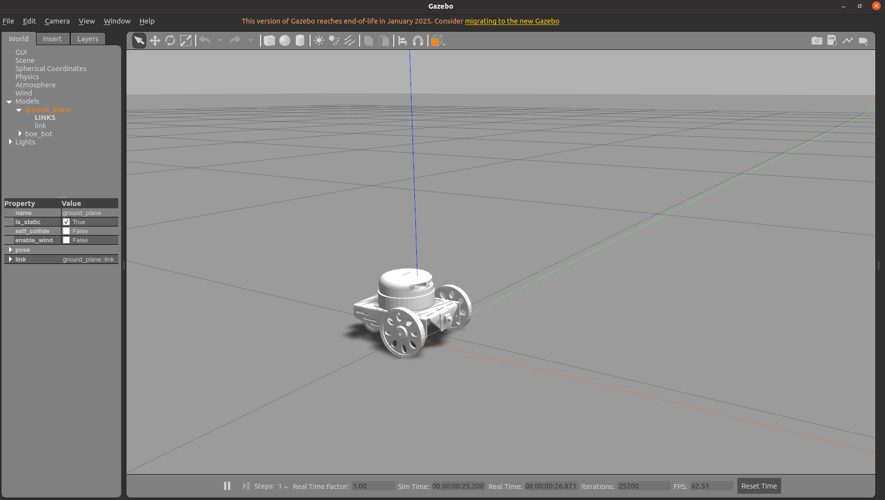
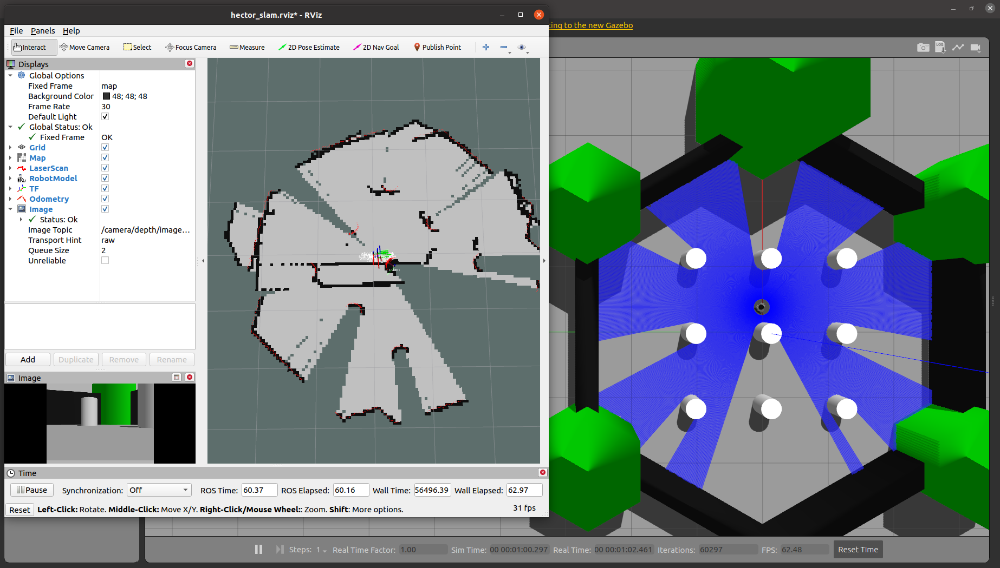
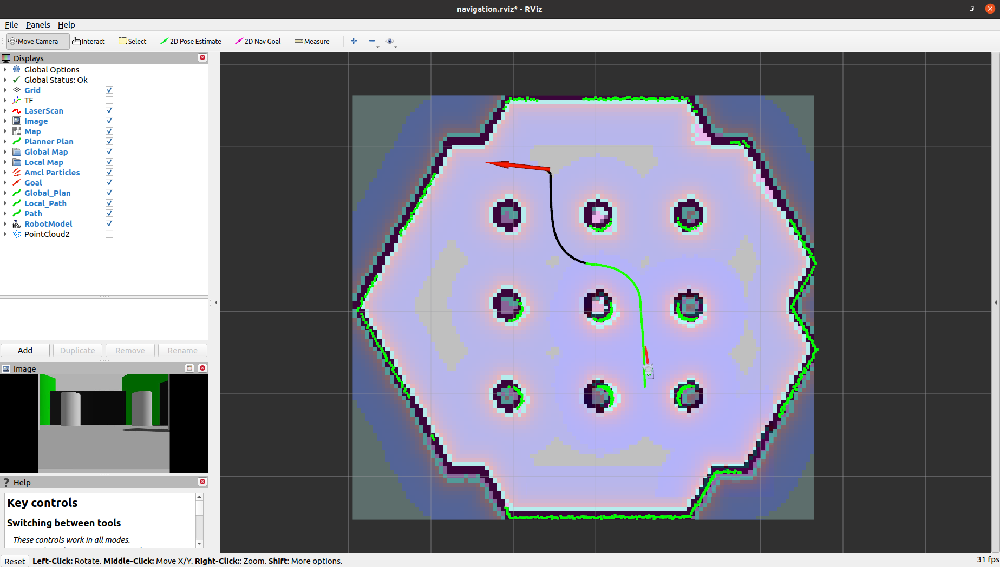
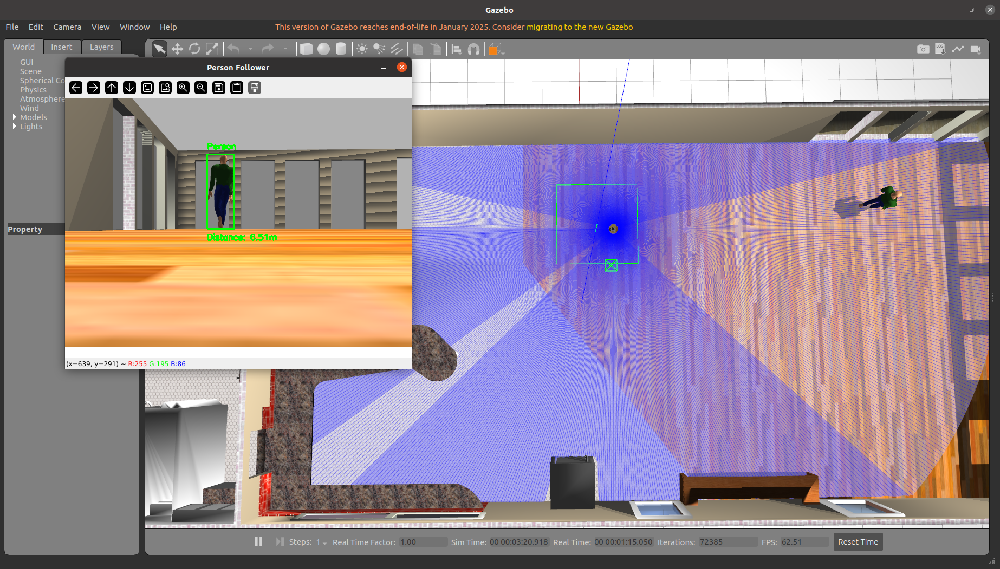

# Diff Drive Robot

[](https://wiki.ros.org/noetic)
[](https://opensource.org/licenses/BSD-3-Clause)
[](https://releases.ubuntu.com/20.04/)

A simulation of a differential drive robot using **ROS Noetic** and **Gazebo**. The project provides a complete simulation stack for the `boe_bot` platform, covering robot description, SLAM mapping (Hector SLAM and Karto SLAM), autonomous navigation, and camera-based human tracking.



---

## 📑 Table of Contents

- [Package Overview](#-package-overview)
- [Prerequisites](#-prerequisites)
- [Installation and Setup](#-installation-and-setup)
- [Usage](#-usage)
  - [Simulate the Robot in Gazebo](#simulate-the-robot-in-gazebo)
  - [SLAM Mapping](#slam-mapping)
  - [Autonomous Navigation](#autonomous-navigation)
  - [Human Tracking](#human-tracking)
- [Package Structure](#-package-structure)
- [License](#-license)

---

## 📦 Package Overview

| Package | Description |
|---|---|
| `boe_bot` | URDF/XACRO robot description and Gazebo launch files |
| `boe_bot_slam` | SLAM mapping using Hector SLAM and Karto SLAM |
| `boe_bot_navigation` | Autonomous navigation using the ROS Navigation Stack (AMCL + move_base) |
| `boe_bot_human_tracking` | Camera-based human detection and following using YOLOv8 |

---

## ⚙️ Prerequisites

- **OS:** Ubuntu 20.04
- **ROS:** [ROS Noetic](https://wiki.ros.org/noetic/Installation/Ubuntu)
- **Python:** 3.8+
- **Gazebo:** 11 (bundled with ROS Noetic)

---

## 🛠️ Installation and Setup

1. Create and configure a Catkin workspace:
   ```bash
   mkdir -p ~/catkin_ws/src
   cd ~/catkin_ws/src
   ```

2. Clone the repository:
   ```bash
   git clone https://github.com/23hoangkt/Diff_drive_robot.git
   ```

3. Install ROS package dependencies:
   ```bash
   cd ~/catkin_ws
   rosdep install --from-paths src --ignore-src -r -y
   ```

4. Install additional ROS packages:
   ```bash
   sudo apt update
   sudo apt install ros-noetic-hector-slam \
                    ros-noetic-slam-karto \
                    ros-noetic-vision-msgs \
                    ros-noetic-teleop-twist-keyboard
   pip3 install ultralytics
   ```

5. Build the workspace:
   ```bash
   cd ~/catkin_ws
   catkin_make
   source devel/setup.bash
   ```

---

## 🚀 Usage

### Simulate the Robot in Gazebo

Launch an empty Gazebo world with the `boe_bot` robot spawned:

```bash
roslaunch boe_bot gazebo.launch
```

---

### SLAM Mapping

#### Hector SLAM

```bash
roslaunch boe_bot_slam boe_bot_hector_slam.launch world_name:="turtlebot3_world.world"
```

#### Karto SLAM

```bash
roslaunch boe_bot_slam boe_bot_karto_slam.launch world_name:="turtlebot3_world.world"
```



> **Custom world:** place your `.world` file in the `worlds/` directory of `boe_bot_slam` and pass its filename via the `world_name` argument.

#### Teleoperate the robot to build the map

```bash
rosrun teleop_twist_keyboard teleop_twist_keyboard.py
```

#### Save the finished map

```bash
rosrun map_server map_saver -f my_map
```

Move the generated `my_map.yaml` and `my_map.pgm` files to the `maps/` directory of `boe_bot_navigation` before running navigation.

---

### Autonomous Navigation

Requires a pre-built map saved as `maps/karto_map.yaml` inside the `boe_bot_navigation` package (the default). A different map can be supplied via the `map_file` argument.

> **Tip:** After saving a map with `map_saver`, copy the `my_map.yaml` and `my_map.pgm` files to `boe_bot_navigation/maps/` and pass the path via `map_file`.

```bash
roslaunch boe_bot_navigation navigation.launch
```

> To use a custom map: `roslaunch boe_bot_navigation navigation.launch map_file:=<path_to_map.yaml>`



[▶ Watch a navigation demo](https://www.youtube.com/watch?v=1PQ_PTzYc9g)

---

### Human Tracking

Detects people with a YOLOv8 model via the robot's camera and follows them autonomously.

```bash
roslaunch boe_bot_human_tracking human_tracker.launch
```



[▶ Watch a human tracking demo](https://www.youtube.com/watch?v=Mz6MIqqkxY4)

---

## 🗂️ Package Structure

```
Diff_drive_robot/
├── boe_bot/                    # Robot description (URDF, meshes, Gazebo launch)
│   ├── urdf/
│   ├── meshes/
│   ├── config/
│   └── launch/
├── boe_bot_slam/               # SLAM mapping (Hector SLAM, Karto SLAM)
│   ├── launch/
│   ├── config/
│   ├── rviz/
│   └── worlds/
├── boe_bot_navigation/         # Autonomous navigation (AMCL + move_base)
│   ├── launch/
│   ├── config/
│   ├── maps/
│   ├── rviz/
│   └── worlds/
└── boe_bot_human_tracking/     # Human detection and following (YOLOv8)
    ├── launch/
    └── scripts/
```

---

## 📄 License

This project is licensed under the BSD License. See the individual `package.xml` files for details.

